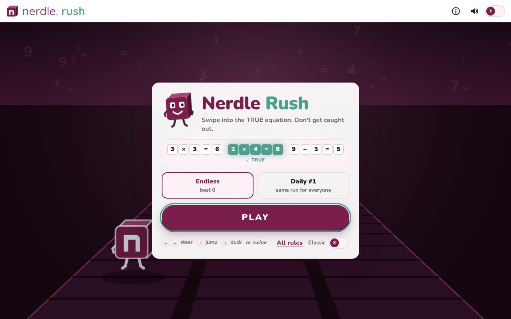
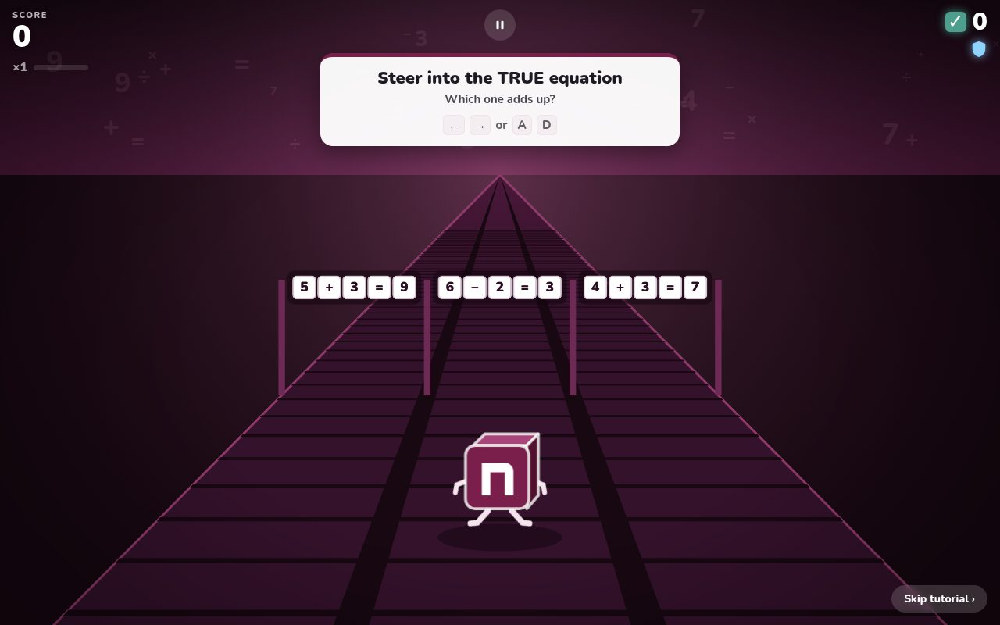
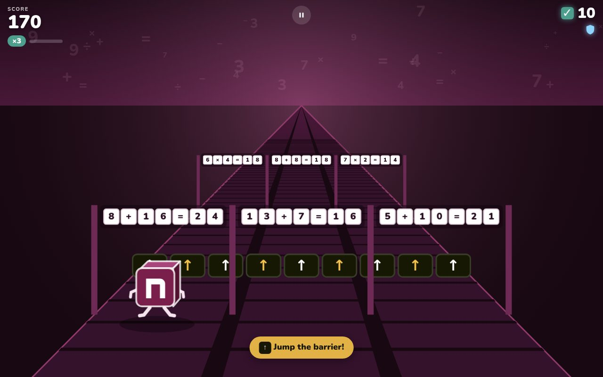
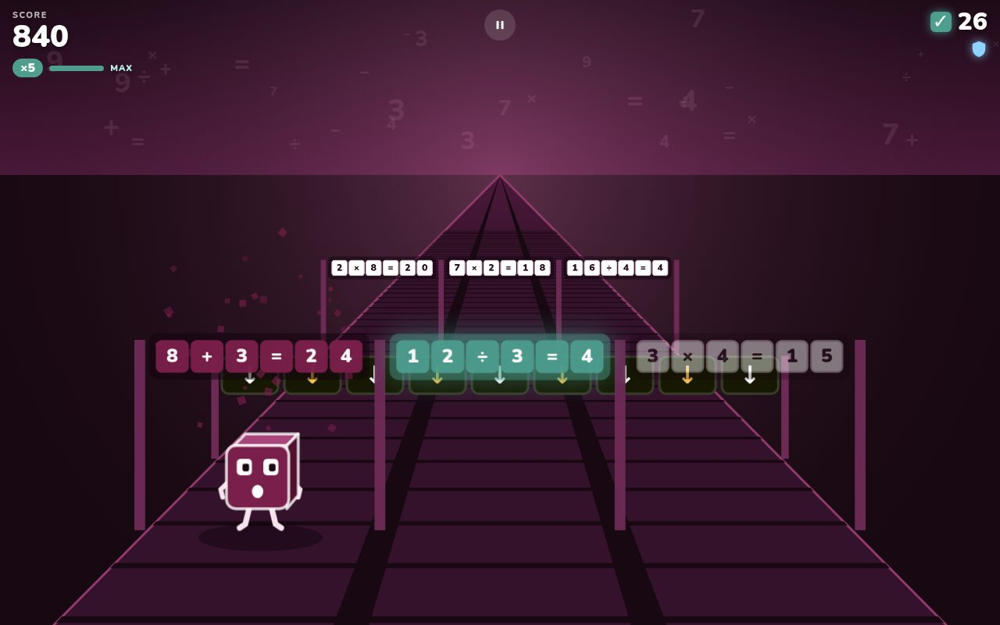
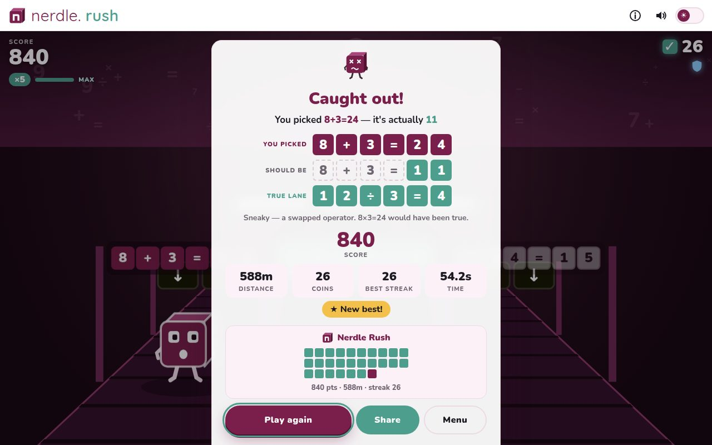
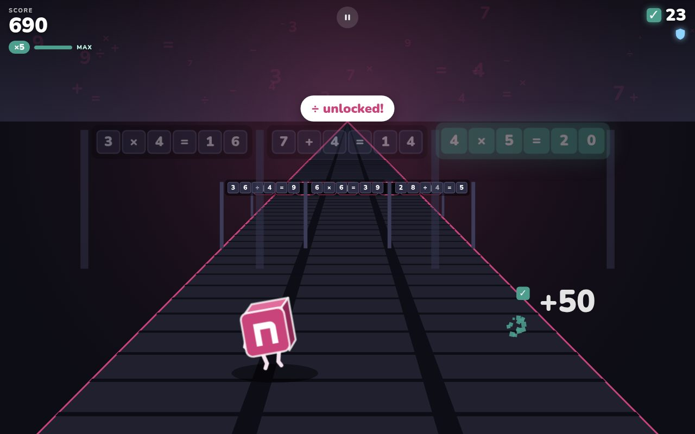
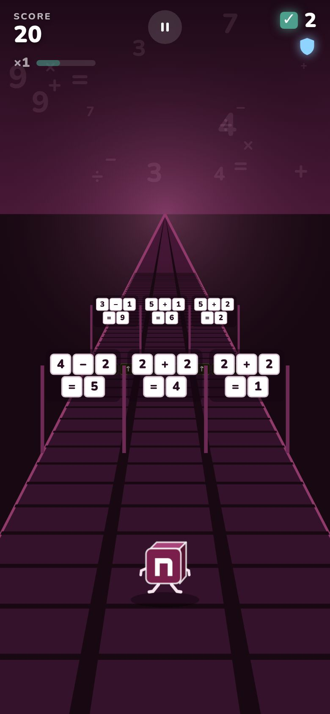

# Nerdle Rush

**An endless runner where the only way forward is the true equation.**

Three lanes. Three equations. Exactly one is true. Steer into it before it reaches you — steer into a false one and the run is over. Instantly. No shield, no second chance, no matter how far you've come.

It's the Nerdle skill — *does this calculation hold?* — compressed into a second, under pressure, getting faster.

> An unsolicited prototype for [Nerdle](https://nerdlegame.com). Built by [Ravjoth Brar](https://ravjothbrar.com).

| Start | Tutorial | Running |
|---|---|---|
|  |  |  |

| Caught out | Game over | Mathlete dark mode | Phone |
|---|---|---|---|
|  |  |  |  |

---

## Play

```bash
npm install
npm run dev        # http://localhost:5173
```

| | Keyboard | Touch |
|---|---|---|
| Change lane | ← → or A D | swipe left / right |
| Jump (barriers) | ↑, W or Space | swipe up |
| Duck (beams) | ↓ or S | swipe down |
| Pause | P or Esc | ⏸ button |

The first time you press **PLAY** you get a 30-second guided tutorial (skippable, replayable from *All rules*).

## The design, in one paragraph

The maths is the point, so the maths is unforgiving: a false lane always ends the run. The platforming is not the point, so it's forgiving: barriers and beams follow standard runner rules — you carry one shield, the first hit costs the shield and your streak multiplier, the second hit ends the run. **Soft on reflexes, hard on maths.**

## How it plays

**Exactly one of three lanes is true, every time.** Each gate is three independently generated equations; one is left true, the other two are perturbed. Independence matters: if the decoys were built from the true equation (7×8=56 / 7×8=54 / 7+8=56), you could find the answer without doing any maths — pick the lane that shares the most with the other two. With independent lanes every sign is an honest true-or-false check. (There's a test for this.)

**Decoys are believable, and get sneakier as your score climbs.** Decoy sharpness is driven by *whichever is further along — time survived or correct answers* — so a strong player hits the hard stuff quickly:

| Decoy | Example | Why it fools you |
|---|---|---|
| Offset | 14+7=**19** | early: off by 3–8 · sharp: off by just 1–2 |
| Forgotten carry / borrow | 47+28=**65**, 52−17=**45** | off by exactly 10 — the units digit is *right*, so the lazy last-digit check fails |
| Times-table neighbour | 7×8=**48**, 56÷8=**6** | the row next door — the classic slip |
| Swapped operator | 9**+**3=6 | the numbers are right, the sign isn't (absurd swaps like 29×8=21 are filtered out) |

Decoys keep the same tile count as the true equation wherever possible, so length is never a tell. Equations never exceed **8 tiles** — the length of a classic Nerdle row.

**Difficulty ramp**

| When | What changes |
|---|---|
| 0s | + and − only, 2.5s between gates, 4.4s to read each one |
| 20s | × unlocks |
| 45s | ÷ unlocks |
| ongoing | gate interval eases 2.5s → 1s; reading window 4.4s → 1.8s; operands grow |
| score-driven | decoys sharpen from "obviously wrong" to near-misses and classic slips |
| 40+ correct | **overdrive**: the track keeps accelerating past the time curve (up to 1.5×), with a ⚡ callout every 15 more |

Physical obstacles start at 7s and are never placed within ~0.4s of a gate, so a jump and a lane decision never collide.

**Scoring.** Each true lane is a coin worth 10 × your multiplier. The multiplier goes up by one every 5 correct in a row (max ×5) and resets to ×1 when you hit an obstacle. Distance and time are tracked as secondary stats.

**Game over explains itself.** *"You picked 7×8=54 — it's actually 56"*, with your pick in plum, the corrected equation, and the true lane in teal — plus a Nerdle-style share card (🟩 correct · 🟨 shield lost · 🟪 caught out · ⬛ crashed).

**Daily Rush.** A seeded run that's identical for everyone on a given day (*Daily #N*), like Nerdle's daily puzzle.

## Brand

Classic mode mirrors nerdlegame.com: plum `#7A1F4B`, teal `#4E9E8E`, white chrome, rounded pill buttons, equation tiles exactly like the Nerdle board (unrevealed → white, true → teal, false → plum). The **mathlete** toggle mirrors Nerdle's mathlete spin-off: navy `#1e1e2e` with hot magenta `#c8447a`. Type is Nunito (tiles, UI) and Quicksand (wordmark), bundled locally. The runner is the Nerdle cube — from behind it wears the "n", and when you're caught out it spins round to face you, aghast.

## Performance

Built to hold 60fps on a mid-range phone. The renderer caches everything static (sky, track, rails) once per resize, rasterises each equation sign and obstacle once into a sprite and then only scales it, batches the moving track seams into one fill, and caps canvas resolution by pixel budget. If frames still run long, adaptive quality lowers the resolution a notch and raises it back once there's headroom. React only re-renders when a HUD number changes.

`npm run perf` (headless Chromium, **no GPU**, in overdrive at top speed):

| Profile | Before optimisation | Now |
|---|---|---|
| Laptop 1440×900 @2x | 31 fps | **60 fps** |
| Phone 390×844 @3x, CPU throttled 4× | 17 fps | **60 fps** |
| Phone 390×844 @3x, CPU throttled 6× | 12 fps | **58 fps** |

## Tests

```bash
npm test           # 64 unit + component tests (Vitest)
npm run build && npm run e2e    # real Chromium: tutorial, runs, caught-out screens
npm run build && npm run perf   # frame-rate benchmark
```

The unit tests check things like:
- every generated gate has exactly one true lane, verified by recomputing the maths rather than trusting the generator
- no negatives, fractions or more than 8 tiles
- lane lengths match; the true lane's position is uniform
- no "odd one out" shortcut
- ×/÷ unlock at 20s/45s
- decoy margins and kinds at each sharpness level; sharp decoys are mostly close cuts
- no absurd operator swaps
- a false lane kills even with a shield and 30 correct behind you
- shield and multiplier rules; invulnerability frames; jump and duck timing
- overdrive speed-ups
- a perfect autopilot survives 3 minutes on 12 seeds, so every run is fair
- obstacles never land on a gate; same seed gives the same run
- the tutorial can't be failed, even by random mashing
- share-card text

The e2e test plays with real key presses, deliberately steers into a false lane, and checks the "it's actually…" value is arithmetically correct.

## Architecture

```
src/
  game/            pure logic — no DOM, fully unit-tested
    equations.js     generator: true equations, decoys, explanations
    difficulty.js    every difficulty knob, as pure functions of time/score
    engine.js        the simulation: createGame / step(game, dt, actions)
    tutorial.js      scripted first-play tutorial on top of the real engine
    scoring.js  share.js  bot.js  rng.js
  render/          canvas renderer, projection, colour themes
  components/      React: GameView (rAF loop), HUD, screens, mascot, tiles
  audio.js         procedural Web Audio sound effects (no audio files)
  input.js         keyboard + swipe → 'left' | 'right' | 'jump' | 'duck'
e2e/               Playwright smoke test + performance benchmark
```

The engine runs on a fixed 120Hz timestep and emits events (`coin`, `death`, `shield`, `unlock`, `speedup`, …). The renderer, audio and HUD only ever *read* state and react to those events. The start screen's background is the same engine driven by an autopilot.

## Deploy

`npm run build` produces a fully static `dist/` with relative asset paths, so it works from any host or sub-path.

It deploys to **GitHub Pages** through `.github/workflows/deploy.yml` on every push to `main`. One-time setup: *Settings → Pages → Source: GitHub Actions*. With `ravjothbrar.com` configured on the user site, the game is served at **ravjothbrar.com/nerdle/**. There's deliberately no `CNAME` in this repo, because that would claim the whole domain. `ci.yml` runs unit tests, the build and the Chromium e2e test on every other branch and PR.
